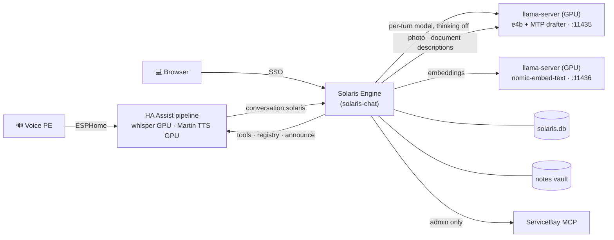

# Solaris

**Solaris** is a household AI assistant that ServiceBay deploys as one
click. Its core is the **Solaris Engine** — a native agent loop inside
`solaris-chat` that talks directly to a local llama.cpp `llama-server`,
controls the home via Home Assistant, and fronts the Voice PE speaker
through HA's Assist pipeline. (The earlier Hermes-gateway architecture was
fully replaced in v0.10 — see `solaris-architecture.md` for the full picture
and flows. Ollama served the chat path until #1318 moved it to llama-server
for speculative decoding, and its last two jobs — embeddings and the vision
ingest — moved in #1332; nothing runs Ollama any more.)



A spoken command answers in ≈1.3 s after speech end (whisper GPU 0.38 s +
engine ≤1 s). The household prompt measured ~7.8k tokens on this box on
2026-08-03 — one household turn against the live HA registry, 34 tools and
51 injected entities. Its composition is logged per prompt assembly as
`engine.prompt.composition` (tools/soul/registry/scaffold), so the number can
be re-measured rather than guessed.

## Features

Detail docs live in [`docs/features/`](docs/features/); the architecture record
is [`solaris-architecture.md`](solaris-architecture.md) and the design
rationale [`docs/solaris-concept.md`](docs/solaris-concept.md). Where the system
is headed — zones, ADRs and the V1 backlog — is
[`docs/solaris-zielarchitektur.md`](docs/solaris-zielarchitektur.md).

### Assistant

- **Voice + Chat, German, GPU-fast.** Talk to the Voice PE (wake word
  **"Solaris"**, on-device) or chat in the browser; a spoken command answers in
  ≈1.3 s. Two chat modes, both on `gemma4:e4b`: **Zuhause** (fast) and
  **Solaris Gründlich** (thorough, reasoning on).
  → [chat-and-voice.md](docs/features/chat-and-voice.md)
- **Home control via Home Assistant.** Lights, covers, media, sensors — with a
  confirmation gate on locks and garage/gate covers. Chat offers 2–4 quick-reply
  chips; voice re-opens the mic when the answer ends in a question.
- **Music & radio.** „Spiele Musik von <Künstler>" plays from Jellyfin; „Spiele
  Radio" resolves a station and remembers your favorite.
- **Timers & reminders.** „Stelle einen Timer auf 10 Minuten" — the engine's
  scheduler rings the speaker back when it fires.

### Household surfaces

- **Favorites start page** (`/p/start`). Pin devices/actions by voice („packe
  das Bürolicht auf meine Startseite"), by ☆ tap, or via the room-grouped card
  picker. **Häufig genutzt** surfaces what you use most; PWA install + mobile
  bottom nav (🏠 Zuhause · 💬 Chats · ⭐ Favoriten).
  → [favorites-start-page.md](docs/features/favorites-start-page.md)
- **Energy page** (`/p/energy`). Live **PV / Haus / Netz / Akku** flow with
  correct directions, lifetime kWh totals, per-circuit power, and 24h/7d trend
  charts. → [energy.md](docs/features/energy.md)
- **Notizen tab** (`/p/notes`). Browse / search / read / edit the vault, see
  stats, and curate the inbox of loose facts.
  → [notes-tab.md](docs/features/notes-tab.md)
- **Concept pages** (`/c/<id>`) render any knowledge entity; `#tag` / `@person`
  mentions in chat auto-link and drive grouping.

### Knowledge

- **One household knowledge graph.** Ask „Wen habe ich letzte Woche gesehen?" —
  a nightly **Stenograph** captures facts from your conversations, a
  **Bibliothekar** consolidates them, and everything is stored as OKF concept
  files (people/events/places/…) with a rebuildable `solaris.db` projection.
  → [knowledge-system.md](docs/features/knowledge-system.md)
- **Unified semantic search.** `okf_vectors` + numpy cosine top-k folded into
  one `notes_search` tool that blends fuzzy, entity/alias, date-range event, and
  semantic hits — all default-deny scoped.

### Ingest

- **Pulls in your on-box data**, read-only and idempotent: Obsidian notes,
  Immich photos, CalDAV/CardDAV calendar & contacts, Jellyfin music, per-person
  IMAP email, and WhatsApp/Signal/SMS export drops.
  → [ingest.md](docs/features/ingest.md)

## What's in this repo

- **Solaris Engine + chat surface** (`solaris-chat/`) — one process owning the
  agent loop (llama-server `/v1/chat/completions`, per-turn model +
  reasoning), the session store (`solaris.db`), native LLM tracing, the timer
  scheduler (speaker delivery via `assist_satellite.announce`), the night
  crons, the chat UI, and the Ollama-**protocol** facade HA's conversation
  agent calls (a compatibility surface for HA, not a dependency on Ollama
  itself). Built into `ghcr.io/mdopp/solaris-chat:latest`.
- **Skill packs** (`templates/solaris/skills/`) — markdown procedure packs
  the engine folds into its prompts: `household/` (incl. the cron-job
  bodies `daily-chronicle`, `problem-summarizer`) and `admin-soul/` (the
  operator persona: `admin-diagnose`, `admin-logs`, `admin-act` + its
  `SOUL.md`).
- **ServiceBay templates** (`templates/{llama,solaris}/`) — two services:
  `llama` (llama.cpp serving the household model with Google's MTP drafter —
  half the wait per answer, #1318 — its multimodal projector for photo and
  document descriptions, and a second small instance serving the embeddings,
  #1332) and `solaris` — one Pod with four
  containers (`chat`, `gatekeeper`, `openwakeword`, `tts-bridge`) plus two
  init containers (`notes-perms`, `schema-init`). `post-deploy.py` seeds the soul,
  adopts the HA token, wires the **voice pipeline** (wyoming whisper/piper,
  the Solaris conversation agent, the Assist pipeline on the Voice PE) and
  mints the `servicebay_admin` MCP token.
- **Batch transcription** (optional, `WHISPER_BATCH_ENABLED`) — a second
  whisper container on the GPU serving timestamped segments for hours-long
  recordings at `POST 127.0.0.1:10301/transcribe`. Its endpoint contract —
  including the default-on silence detection and the discarded-silence figure it
  reports — is [whisper-batch-api.md](docs/features/whisper-batch-api.md).
- **Solaris stack** (`stacks/solarisbay/stack.yml`) — bundles the two
  templates so a ServiceBay operator can install with one click.
- **Voice gatekeeper image source** (`voice-gatekeeper/`) — Python
  Wyoming-protocol bridge for wyoming-satellite hardware (the Voice PE
  itself rides HA's Assist pipeline); turns run against the engine's
  facade. Built into `ghcr.io/mdopp/solaris-gatekeeper:latest`.
- **Database image source** (`database/`) — Alembic schema-init container
  that runs `alembic upgrade head` against `solaris.db` on every pod
  start. Built into `ghcr.io/mdopp/solaris-schema-init:latest`.
- **Wakeword trainer image source** (`wakeword-trainer/`) — the GPU
  companion that claims queued `wakeword_training_runs` and trains the
  on-device microWakeWord "Solaris" model. The engine can only enqueue;
  training needs TensorFlow and the GPU. Built into
  `ghcr.io/mdopp/solaris-wakeword-trainer:latest`.

## Install

1. ServiceBay → Settings → Registries → Add `mdopp/solarisbay`
   (`https://github.com/mdopp/solarisbay.git`).
2. After save, the `llama` and `solaris` templates and the `solarisbay` stack
   appear in the wizard.
3. Install the stack. The `solaris` template's `post-deploy.py` does the
   rest (soul, HA token adoption, jellyfin integration, voice pipeline,
   admin MCP token).

## Repository layout

```
solarisbay/
├── README.md                       # this file
├── solaris-architecture.md         # the architecture record
├── templates/                       # ServiceBay templates
│   ├── ollama/                       # RETIRED (#1332) — tombstone README only
│   ├── llama/                        # llama.cpp: the chat model + MTP drafter + embeddings
│   └── solaris/                      # the assistant service
│       ├── template.yml             # one Pod: chat, gatekeeper, openwakeword, tts-bridge
│       ├── post-deploy.py           # soul + HA wiring + admin MCP token
│       ├── variables.json
│       └── skills/
│           ├── household/           # household skill pack (engine prompts)
│           └── admin-soul/          # operator skill pack + SOUL.md
├── solaris-chat/                   # Docker image source (the Solaris Engine)
├── voice-gatekeeper/               # Docker image source (Wyoming bridge)
├── database/                       # Docker image source (alembic)
├── wakeword-trainer/               # Docker image source (microWakeWord GPU)
├── stacks/
│   └── solarisbay/
│       └── stack.yml               # templates: [llama, solaris]
└── .github/workflows/
    └── build-images.yml            # publishes the GHCR images
```

## Image build

`.github/workflows/build-images.yml` publishes
`ghcr.io/mdopp/solaris-chat`, `ghcr.io/mdopp/solaris-gatekeeper` (+ `-ml`),
`ghcr.io/mdopp/solaris-schema-init` and
`ghcr.io/mdopp/solaris-wakeword-trainer` on release tags (`v*`, via
release-please) and pushes to `main`.

## License

MIT. See [LICENSE](LICENSE).
