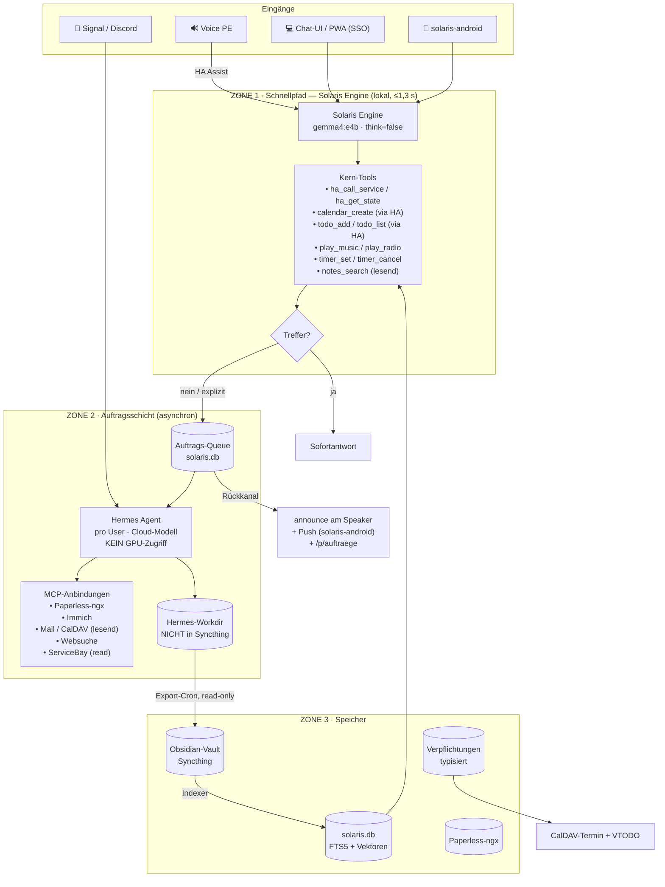
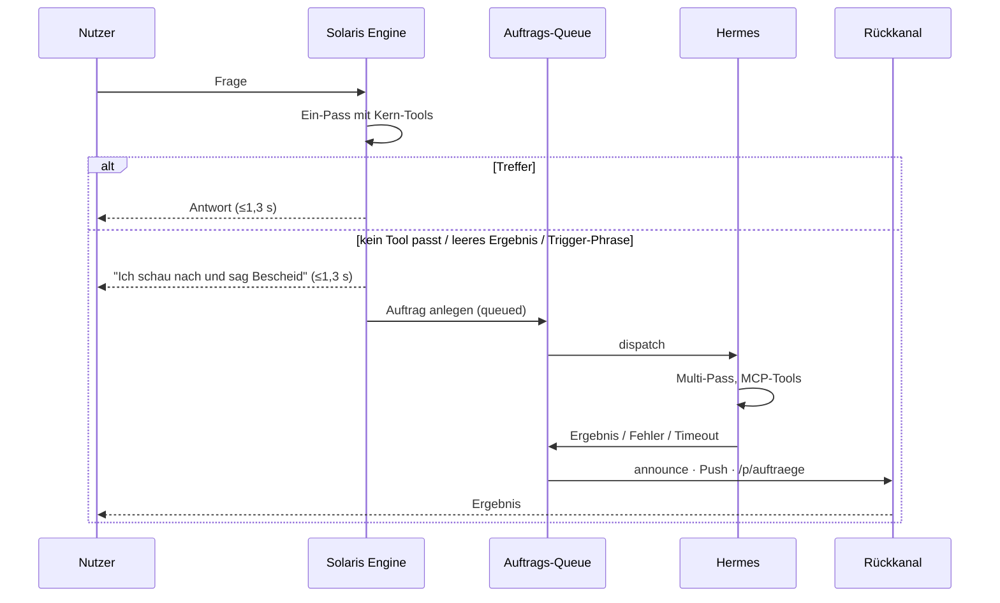
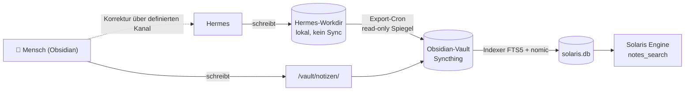
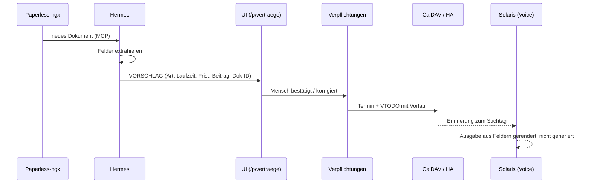
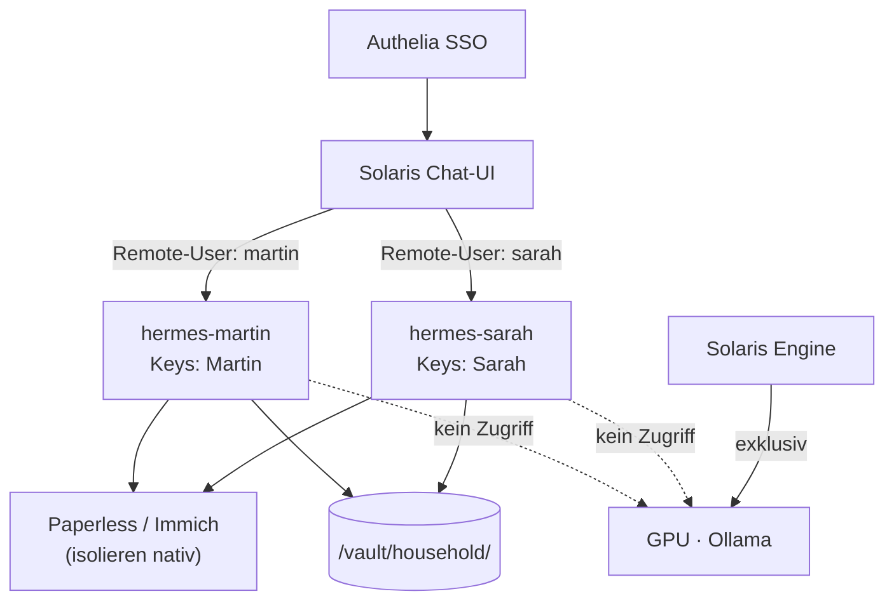
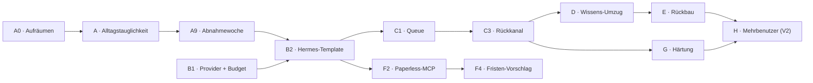

# Solaris · Zielarchitektur

**Status:** Entwurf zur Umsetzung
**Datum:** August 2026
**Systeme:** `solarisbay` · `solaris-android` · `servicebay` · Hermes Agent (Nous Research)
**Ersetzt:** „Architektur-Zielbild: Solaris Engine & Hermes Agent Transformation" (Juli 2026)

---

## 1. Zweck

Dieses Dokument beschreibt die Zielarchitektur des Haushaltssystems und legt fest, welche
Fähigkeiten selbst gebaut, welche zugekauft und welche gelöscht werden. Es ist die
Referenz für alle folgenden Entwicklungsschritte; Abweichungen davon gehören als neue
ADR hier hinein und nicht in den Code.

Die zentrale Leitfrage lautet nicht „Solaris oder Hermes", sondern: **Welche Anfrage hat
welches Zeitbudget, und wer darf sie sehen?**

---

## 2. Randbedingungen

| Randbedingung | Wert | Konsequenz |
| :--- | :--- | :--- |
| GPU | RTX 2000 Ada, 16,4 GB VRAM | Eine GPU serialisiert — jede zweite Last gefährdet die Sprachlatenz |
| Lokales Sprachmodell | `gemma4:e4b` (einziges) | Kein zweites lokales Modell; `gemma4:12b` entfällt ersatzlos |
| Sprachlatenz | ≤ 1,3 s ab Sprachende | Harte Grenze, kein Verhandlungsspielraum |
| Restliche GPU-Last | Whisper · Kokoro-TTS · `nomic-embed-text` | Bleiben resident |
| Anwärter auf freien VRAM | Immich ML · Wakeword-Trainer · ggf. OCR | Freiraum ist verplant, nicht Reserve |
| Identität | LLDAP + Authelia | Vorhanden für UI-Kanäle, nicht für Sprache |
| Betrieb | ServiceBay auf Fedora CoreOS, Podman Quadlet | Alles Neue ist ein Template |
| Musik | Jellyfin (nicht Navidrome) | ServiceBay-Doku ist an dieser Stelle veraltet |
| Kalender & Listen | Radicale (CalDAV + VTODO) | Beides über eine Instanz, keine zweite Ablage |
| Dokumente | Paperless-ngx — **noch nicht deployed** | Neues Template, Voraussetzung für Spalte F |
| Nutzerzahl | V1 einbenutzerfähig, mehrere ab V2 | Trennung wird vorbereitet, nicht gebaut |
| Reifegrad | Testsystem. Im Alltag genutzt: HA-Steuerung über die Android-Widgets, Musik über Jellyfin + Symfonium. | Kein Rückbau-Risiko außerhalb dieser beiden Pfade |
| Datensouveränität | EU oder eigene Hardware. Keine US- und keine chinesischen Anbieter. | Bestimmt die Modellwahl (ADR-17, ADR-18) |

### Versionsbänder

| Band | Umfang |
| :--- | :--- |
| **V1** | Ein Nutzer. Schnellpfad-Ausbau, Hermes-Pilot, Auftragsschicht, Wissens-Umzug, Rückbau, Dokumente & Fristen, Härtung. |
| **V2** | Mehrbenutzer: Instanz pro Haushaltsmitglied, Authelia-Routing, Sprecher-ID als Kontext. |
| **V3** | Offen — was sich aus dem Betrieb ergibt. |

### Abnahmekriterium V1

V1 ist nicht über eine Featureliste definiert, sondern über tatsächliche Nutzung:

> **Eine Woche, in der Timer, Musik, Licht, Termine und Einkaufsliste ausschließlich
> über Solaris laufen.**

Das größte Risiko dieses Projekts ist nicht Datenverlust, sondern nie aus dem
Teststatus herauszukommen. Ein System, das niemand täglich benutzt, liefert kein Signal
darüber, was wirklich fehlt — und dann wird an Vermutungen entlang optimiert. Alles, was
für diese Woche nicht nötig ist, kommt danach.

Der Test hat einen unbequemen Teil: Musik läuft heute über Symfonium, nicht über
Sprache. Der Schnellpfad muss dagegen gewinnen, sonst ist `play_music` gebaut, aber
totes Gewicht.

---

## 3. Leitprinzipien

Diese fünf Sätze entscheiden im Zweifel jede Detailfrage.

1. **Zeitbudget bestimmt den Ort.** Alles unter 1,3 s läuft lokal in der Solaris Engine.
   Alles darüber ist ein Auftrag, kein Dialogturn.
2. **Die GPU gehört der Sprache.** Kein anderer Prozess belegt sie synchron.
3. **Harte Fakten werden nicht generiert, sondern eingesetzt.** Ein 4B-Modell wählt aus,
   es formuliert keine Zahlen und keine Daten.
4. **Ein Datum, ein Besitzer.** Jede Information hat genau ein System, das sie schreibt.
   Alle anderen lesen Projektionen.
5. **Was im Alltag genutzt wird, wird erst nach bewiesenem Ersatz abgeschaltet.**
   Was niemand nutzt, wird sofort gelöscht.

---

## 4. Gesamtbild

---

## 5. Zone 1 — Schnellpfad

Die Solaris Engine bleibt unverändert das, was sie ist: ein schlanker Ein-Pass-Loop mit
injizierter HA-Registry, ~2,1k Prompt, `think=false`. Sie beantwortet alles, was eine
feste Antwortform hat.

**Bestand:** Haussteuerung mit Confirmation Gates · Musik & Radio über Jellyfin ·
Timer/Wecker mit Speaker-Rückmeldung · lesende Vault-Suche · Chat-UI · Startseite,
Energie, Notizen, Konzeptseiten · Android-Widgets.

**Neu, ohne neue Konnektoren:** Kalendereinträge und Listen laufen über bereits
vorhandene Home-Assistant-Dienste (`calendar.create_event`, `todo.add_item`,
`todo.get_items`) und damit über das existierende `ha_call_service`. Es entstehen keine
zweiten Credentials und keine zweite CalDAV-Implementierung. Voraussetzung ist, dass
Radicale als Kalender- und VTODO-Integration in HA eingebunden ist.

**Was den Schnellpfad verlässt:** der 6-Pass-Loop `solaris-deep`, eigene Websuche und
Scraper, die Wissens-Crons (Stenograph, Bibliothekar). Der **Timer- und
Alarm-Scheduler bleibt** — er ist Kernfunktion, nicht Wissensarbeit, und liefert
zusätzlich den Rückkanal für Zone 2.

---

## 6. Zone 2 — Auftragsschicht

### 6.1 Eskalation ist deterministisch

Ein vorgeschalteter Klassifikator würde Latenz kosten und in beide Richtungen
falsch liegen. Stattdessen:

Zusätzlich zur automatischen Eskalation gibt es eine **explizite Auslösephrase**
(„schau mal genauer nach"), damit sie erzwingbar ist.

### 6.2 Die Auftrags-Queue

Tabelle in `solaris.db`:

`id · requester · kanal (voice|ui|android|signal) · anfrage · status · erstellt ·
gestartet · beendet · hermes_session_id · ergebnis_ref · kosten`

Status: `queued · running · done · failed · timeout`

Die `hermes_session_id` mitzuführen ist nicht optional — ohne sie ist ein
fehlgeschlagener Auftrag in Hermes' Session-Store nicht wiederauffindbar.

**Timeout mit Zustellung** ist Pflicht: Läuft ein Auftrag über die Grenze, wird der Turn
abgebrochen, der Status gesetzt und der Nutzer benachrichtigt. Stille Zombies sind sonst
gleichzeitig ein UX- und ein Kostenproblem.

### 6.3 Hermes-Betrieb

- **Eigenes Modell außerhalb der Voice-GPU.** Siehe ADR-02 und 6.4.
- **Ein Container pro Haushaltsmitglied** mit eigenen API-Keys für Paperless und Immich.
  Die Datentrennung übernehmen die Backends, nicht eigener Filtercode.
- **Toolsets eng geschnitten.** Der Prefill besteht überwiegend aus Tool-Schemas.
- **ServiceBay-MCP nur mit `read`-Token.** Die Scope-Leiter existiert bereits.
- **Messaging-Gateway aktiv** für Signal und Discord — der Teil, den selbst zu bauen
  sich am wenigsten lohnt.

### 6.4 Das Modell für Zone 2

Die Anforderung ist Souveränität, nicht Kosten (ADR-17): keine US-amerikanischen und
keine chinesischen Anbieter im Zielsystem. Damit bleibt **Mistral** als praktisch
einzige Modellfamilie — was kein Trostpreis ist.

| Modell | Größe | Lizenz | Speicher (Q4) | Rolle |
| :--- | :--- | :--- | :--- | :--- |
| Devstral Small 2 | 24B dense | Apache 2.0 | ~14 GB | Einstieg |
| **Mistral Small 4** | 119B MoE, ~6B aktiv | CC BY-NC 4.0 | **~65 GB** | **Zielmodell** |
| Devstral 2 | 123B | offen | ~70 GB | Spezialist lange Tool-Loops |
| Mistral Large 3 | 675B MoE, 41B aktiv | Apache 2.0 | ~340 GB | Obergrenze |

**Warum Mistral Small 4:** Es vereint Reasoning, Vision und agentisches Coding in einem
konfigurierbaren Modell. Entscheidend ist die MoE-Bauform — von 119 Milliarden
Parametern sind pro Token nur rund 6 Milliarden aktiv. Für einen Keller ist das ideal:
**Kapazität ist billig (RAM), Bandbreite ist teuer.** Ein Modell mit wenigen aktiven
Parametern läuft auch auf langsamem Unified Memory brauchbar, und asynchrone Aufträge
haben ohnehin kein Latenzbudget.

Lizenzhinweis: Small 4 ist nicht-kommerziell — für den Haushalt unproblematisch, für
eine Veröffentlichung nicht. Devstral Small 2 und Large 3 sind Apache 2.0.

#### Hardware-Stufen

| Ziel | Speicher | Hardware | Grob |
| :--- | :--- | :--- | :--- |
| Devstral Small 2 | 24 GB | gebrauchte 24-GB-Karte | 600–900 € |
| **Mistral Small 4** | **~65 GB** | **128-GB-Unified-Memory-Box** | **2.000–4.000 €** |
| Mistral Large 3 | ~340 GB | 512-GB-Unified oder EPYC mit viel RAM | 8.000–15.000 € |

Eine 128-GB-Box kostet weniger als eine einzelne 48-GB-Profikarte, liegt im Leerlauf bei
10–30 W statt 60–100 W und steht **physisch neben** dem Sprachserver statt darin — damit
gilt ADR-02 ohne Verrenkung.

#### Der Weg dorthin

**Erprobung:** Mistral-API (Paris, EU-Datenresidenz) oder ein EU-Hoster offener Gewichte
(IONOS, Scaleway, OVHcloud). Datenresidenz ist nicht Besitz, aber sie ist rechtlich real
und trägt, bis die eigene Hardware steht.

**Zielzustand:** eigene Box. Der Kaufzeitpunkt liegt bewusst **nach** den ersten Wochen
Auftragsbetrieb — dann ist bekannt, wie viele Aufträge pro Tag anfallen und wie groß sie
sind. Ob 65 GB reichen oder Large 3 nötig wird, ist dann eine Messung statt einer
Schätzung. Die Queue-Schnittstelle ist so zu bauen, dass der Wechsel eine
Konfigurationsänderung bleibt.

---

## 7. Zone 3 — Speicher und Besitzverhältnisse

Vier Klassen, vier Besitzer. Das ist die wichtigste Tabelle des Dokuments.

| Klasse | Beispiel | Besitzer (schreibt) | Leser | Eigenschaft |
| :--- | :--- | :--- | :--- | :--- |
| **Weiches Gedächtnis** | Präferenzen, „wen habe ich getroffen" | Hermes (Memory-Loop, Curator) | Solaris via Index | darf verblassen, Fehler billig |
| **Dokumente** | Rechnungen, Policen, Scans | Paperless-ngx | Hermes via MCP | OCR, Tags, Volltext |
| **Verpflichtungen** | Fristen, Beiträge, Laufzeiten | Mensch (bestätigt) | Solaris, Cron | typisiert, validiert, langlebig |
| **Notizen** | manuell Geschriebenes | Mensch (Obsidian) | alle | frei |

### Warum das Hermes-Workdir nicht im Syncthing-Ordner liegt

Der Hermes-Curator bewertet, konsolidiert und **löscht** seine Bibliothek autonom.
Syncthing löst Konflikte durch `sync-conflict`-Kopien. Ein autonom kürzender Prozess auf
einem eventually-consistent Ordner mit parallelen Handy-Edits produziert früher oder
später stillen Datenverlust — und der Indexer zieht die Konfliktkopien mit hinein.
Deshalb: Hermes arbeitet lokal, ein Cron spiegelt read-only in den Vault.
Menschliche Korrekturen laufen über einen definierten Kanal zurück, nicht durch
Direkt-Edit derselben Datei.

---

## 8. Querschnittsthemen

### 8.1 Identität und Sichtbarkeit

Sprechererkennung setzt den **Kontext** (eigene Favoriten, eigene Musik, eigene Timer).
Sie ist **keine Autorisierung**: Fernfeld-Erkennung ist unzuverlässig, und ein
aufgenommener Satz genügt als Angriff. Der Fehlerfall wäre ein Datenleck innerhalb der
Familie.

Daraus folgen drei Sichtbarkeitsklassen:

| Klasse | Beispiel | Sprache | SSO-Kanal |
| :--- | :--- | :--- | :--- |
| **Haushalt** | Heizung, Einkaufsliste, Familientermine | ✅ | ✅ |
| **Persönlich** | eigene Mails, eigene Fotos, eigene Termine | ✅ nur mit Sprecher-Treffer | ✅ |
| **Vertraulich** | Verträge, Versicherungen, Finanzen | ❌ nie | ✅ |

Am Speaker antwortet die vertrauliche Klasse mit einem Verweis, nicht mit Inhalt.

> **Ehrlicher Vorbehalt:** Der eigene Signal-Chat ist Direktzugang zu Hermes, an Solaris
> vorbei. Das ist gewollt — es war der Grund, Hermes überhaupt zu holen. Aber die
> Durchsetzung aus dieser Tabelle greift dort nicht; dort schützt allein die
> Container-Isolation aus Weg C. In V1 mit nur einer Instanz ist der Signal-Kanal damit
> faktisch unbeschränkt. Vertretbar, solange nur eine Person ihn nutzt — aber es darf
> niemanden überraschen.

### 8.5 Modelle und die Konfigurationsgrenze

**Die Modellauswahl ist keine Konfiguration mehr, sondern eine Eigenschaft der Zone.**

Zone 1 hat genau ein Modell: `gemma4:e4b`, `think=false`. Eine Auswahlmöglichkeit wäre
nur eine Möglichkeit, die Latenzgarantie zu verletzen. Der Wert steht in ADR-01 und
ADR-03, nicht in einer Einstellung. Damit entfällt auch der Per-Turn-Schalter `think`:
sein Zweck war das Umschalten zwischen schnell und gründlich, und diese Entscheidung ist
jetzt die Eskalation — deterministisch nach ADR-10, nicht konfigurierbar.

Zone 2 wählt Hermes über seine eigene Provider- und Modellkonfiguration. Die wird
**nicht** in Solaris gespiegelt; zwei Wahrheiten über dasselbe sind schlimmer als eine
unbequeme.

Was von der bisherigen Konfiguration bleibt, sind Betriebsparameter, keine Modellnamen:
Ollama-Endpunkt, Kontextgröße, `keep_alive = -1` (damit e4b nie entladen wird) und das
Embedding-Modell für den Indexer.

#### Wer darf was einstellen

Die Trennlinie ist nicht Schwierigkeit, sondern **Blast Radius**.

| In `solaris-chat` (jeder Nutzer) | Nur ServiceBay / CLI (Betreiber) |
| :--- | :--- |
| Benachrichtigungs-Routing (Speaker, Push, Dringlichkeit) | Provider, Modell, Budget, Timeouts |
| Ansprache und Ton (Fortsetzung von `SOUL.md`) | Toolsets und MCP-Ziele |
| Sichtbarkeitsklassen des eigenen Kanals | Skills, Curator-Zyklus |
| Aufträge: ansehen, abbrechen, wiederholen | Messaging-Bridges einrichten |
| Erinnerungen ansehen und korrigieren | Ollama-Betriebsparameter |

Wer den Ton ändert, kann nichts kaputtmachen. Wer Toolsets ändert, verschiebt Prefill
und Kosten.

**Umfang in V1:** nur Benachrichtigungs-Routing und Korrekturkanal. Jede weitere
gespiegelte Einstellung ist ein Schema, das bei Hermes-Updates brechen kann. Der Rest
kommt erst, wenn die Abnahmewoche zeigt, dass er fehlt.

### 8.2 Benachrichtigung

Der ausgehende Kanal existiert bereits über `solaris-android`. Routing:

| Dringlichkeit | Zustellung |
| :--- | :--- |
| Beiläufig | `/p/auftraege`, kein Push |
| Normal | Speaker bei Anwesenheit, sonst Push |
| Wichtig (Fristen) | Push **und** Speaker |
| Push fehlgeschlagen | Signal als Fallback |

### 8.3 Degradation ohne Internet

Der lokale Kern läuft weiter: Wake Word, Haussteuerung, Timer, Musik, Vault-Suche, TTS.
Die Eskalation prüft Konnektivität **vor** Auftragsannahme und antwortet sofort
(„Nachschlagen geht gerade nicht, ich hole es nach"); der Auftrag bleibt `queued` und
wird bei Rückkehr abgearbeitet. Kein Timeout-Warten am Lautsprecher.

Zu prüfende stille Abhängigkeiten: Authelia, DNS über AdGuard, NTP-Drift,
Zertifikatserneuerung bei längeren Ausfällen.

### 8.4 Kosten

Sichtbarkeit liefert Hermes selbst (`/usage`, `/insights`), vertieft durch `agenttrace`
(Kosten-Spitzen, Tool-Fehler, Retry-Loops). Der **harte Deckel gehört zum Provider**
(Budget-Limit auf dem API-Key) — ein Prozess, der seine eigenen Kosten begrenzen soll,
versagt genau dann, wenn er kaputt ist. Zweiter Gürtel: Zeitlimit pro Auftrag.

---

## 9. Praxisfall: Vertrag mit Frist

Extraktion ist immer ein Vorschlag. Eine Kündigungsfrist ist entweder korrekt oder sie
kostet eine automatische Verlängerung — das ist kein Fall für die weiche Ebene.

---

## 10. Multi-User (V2)

Hermes ist ein schlanker Python-Prozess; mehrere Instanzen kosten kaum Speicher. Der
entscheidende Zusatz gegenüber dem Vorentwurf: **keine Instanz fasst die GPU an.**

**Was V1 dafür schuldet:** Das Hermes-Template bekommt von Anfang an einen
Profil-Parameter (Name, Key-Set, Workdir-Pfad, Vault-Unterordner) — auch wenn es nur
einmal instanziiert wird. Ebenso führen Queue und Rückkanal von Beginn an einen
`requester` mit. Beides kostet in V1 fast nichts; nachträglich eingezogen ist es ein
Schema-Umbau mit Datenmigration. Siehe G-9.

---

## 11. Architekturentscheidungen (ADR)

| ID | Entscheidung | Begründung |
| :--- | :--- | :--- |
| **ADR-01** | Die Solaris Engine behält das Ollama-Facade für HA Assist. | Garantiert ≤1,3 s am Voice PE. |
| **ADR-02** | **Hermes erhält keinen Zugriff auf die Voice-GPU** und läuft auf getrennter Rechenkapazität — EU-gehostet in der Erprobung, eigene Hardware im Zielzustand. | Eine GPU serialisiert. Ein Hermes-Turn würde jeden Sprachbefehl dahinter einreihen — genau die 3–6 s, wegen derer Hermes im Juni entfernt wurde, nur diesmal sporadisch und damit schlimmer. |
| **ADR-03** | `gemma4:e4b` ist das einzige lokale Sprachmodell. `gemma4:12b` entfällt. | 16,4 GB VRAM; freier Speicher ist für Immich-ML und Wakeword-Training verplant. Folge: der Chat-Modus „Solaris Gründlich" wird durch die Auftragsschicht ersetzt. |
| **ADR-04** | Der eigene Agenten-Loop (`solaris-deep`), Websuche und Scraper werden gelöscht. | Redundanz zu Hermes; tausende Zeilen eigener Agentencode entfallen. |
| **ADR-05** | Weiches Gedächtnis zieht zu Hermes (Memory-Loop + Curator). Stenograph und Bibliothekar werden abgeschaltet. | Gepflegtes Ökosystem statt Eigenbau; identisches Problem, fremde Wartung. |
| **ADR-06** | **Hermes' Arbeitsverzeichnis liegt außerhalb des Syncthing-Vaults; ein Export-Cron spiegelt read-only.** | Autonomes Pruning + eventual consistency + parallele Handy-Edits = stiller Datenverlust. |
| **ADR-07** | Verpflichtungen sind eine typisierte Tabelle mit menschlicher Bestätigung; Ausspielung über CalDAV/VTODO. | Fristen sind Domänenlogik, keine Agentenaufgabe. Hermes' Cron erinnert, entscheidet aber nicht. |
| **ADR-08** | Paperless-ngx ist der Dokumententresor. Kein Eigenbau für OCR, Tagging, Ablage. | Fertig, ausgereift, ServiceBay-Template. |
| **ADR-09** | Keine neuen Konnektoren in Solaris. Drittsysteme hängen als MCP an Hermes; Kalender- und Listenschreiben laufen über Home Assistant. | Keine zweiten Credentials, keine zweite CalDAV-Implementierung. |
| **ADR-10** | Eskalation ist deterministisch (Fast-Loop zuerst, Fehlschlag eskaliert) plus explizite Phrase. | Ein Vorab-Klassifikator kostet Latenz und irrt beidseitig. |
| **ADR-11** | Ergebnisse aus Zone 2 kommen asynchron über `announce` und Push zurück, nie als blockierender Call. | Ein Hermes-Turn ist zweistellig in Sekunden; am Speaker wäre das Stille. |
| **ADR-12** | Sprechererkennung ist Kontext, nicht Autorisierung. Vertrauliches nie über Sprache. | Fernfeld-Erkennung ist täuschbar; Fehlerfall ist ein Datenleck in der Familie. |
| **ADR-13** | Der harte Kostendeckel liegt beim Provider, nicht im Agenten. | Selbstbegrenzung versagt im Fehlerfall. |
| **ADR-14** | `solaris-chat` bleibt die einzige Haushaltsoberfläche. | Eine PWA, ein SSO, ein Ort. |
| **ADR-15** | **Die Modellwahl ist Zonen-Eigenschaft, keine Konfiguration.** Zone 1 hat genau ein Modell ohne Auswahl; der Per-Turn-Schalter `think` entfällt. Hermes' Modellkonfiguration wird nicht in Solaris gespiegelt. | Eine Auswahl in Zone 1 wäre nur ein Weg, die Latenzgarantie zu brechen. Zwei Wahrheiten über dieselbe Einstellung sind schlimmer als eine unbequeme. |
| **ADR-16** | **Konfiguration wird nach Blast Radius aufgeteilt.** Verhalten (Benachrichtigung, Ton, Sichtbarkeit, Aufträge, Erinnerungen) in `solaris-chat`; Betrieb (Provider, Budget, Toolsets, MCP, Skills, Bridges) nur über ServiceBay/CLI. | Kein Haushaltsmitglied braucht die Hermes-CLI, um seinen Assistenten zu benutzen (ADR-14). Umgekehrt darf niemand versehentlich Prefill und Kosten verschieben. |
| **ADR-17** | **Datensouveränität: EU oder eigene Hardware.** Keine US-amerikanischen und keine chinesischen Anbieter im Zielsystem — weder für Inferenz noch für Speicher. | Die rechtliche Lage außerhalb der EU ist zu fragil; Rechte an den eigenen Daten werden dort bereits heute unzureichend geschützt. Das ist keine Kostenfrage und wird nicht gegen Kosten abgewogen. |
| **ADR-18** | **Zone 2 fährt Mistral.** Zielmodell `Mistral Small 4` (119B MoE, ~6B aktiv) auf einer eigenen 128-GB-Unified-Memory-Box; EU-gehostete API während der Erprobung. Kaufzeitpunkt nach Messung des Auftragsvolumens. | Aus ADR-17 folgt Mistral als praktisch einzige Familie. Die MoE-Bauform passt zum Keller: Kapazität ist billig, Bandbreite teuer, und asynchrone Aufträge haben kein Latenzbudget. |

---

## 12. Entwicklungs-Guidelines

**G-1 · Zahlen und Daten werden nicht generiert.**
Retrieval liefert strukturierte Records; die Ausgabe rendert ein Formatter aus Feldern.
Zusätzlich ein Nachprüfer: Jede Zahl und jedes Datum in der Antwort muss im
Retrieval-Kontext vorkommen — sonst wird verworfen und der Record wörtlich vorgelesen.
Kostet keine Latenz und fängt den gefährlichsten Fehlermodus eines 4B-Modells.

**G-2 · Kein neues Tool im Schnellpfad ohne Latenzmessung.**
Jedes Tool vergrößert das Schema und damit den Prefill. Aufnahme nur mit gemessener
p95-Latenz vor und nach der Änderung.

**G-3 · Jede Fähigkeit hat genau einen Besitzer.**
Vor jedem neuen Feature: Welche Speicherklasse (Abschnitt 7)? Wer schreibt? Wenn die
Antwort „beide" lautet, ist der Entwurf falsch.

**G-4 · Rückbau nach Nutzung, nicht nach Kalender.**
Code auf einem täglich genutzten Pfad (HA-Steuerung, Musik, Timer) wird deaktiviert,
beobachtet, dann gelöscht. Code, den niemand benutzt, wird sofort gelöscht — ihn
„sicherheitshalber" mitzuschleppen kostet Pflege und macht jede Antwort mehrdeutig,
weil unklar bleibt, welcher Loop sie erzeugt hat.

**G-5 · Alles Neue ist ein ServiceBay-Template.**
Kein handgepflegter Container, keine Sonderinstallation.

**G-6 · Sichtbarkeitsklasse ist Pflichtangabe.**
Jedes Tool, das Daten liest, deklariert Haushalt / Persönlich / Vertraulich. Ohne
Angabe gilt Vertraulich.

**G-7 · Jeder externe Aufruf hat ein Zeitlimit und einen sichtbaren Zustand.**
Kein Fire-and-forget ohne Queue-Eintrag.

**G-8 · Der lokale Kern bleibt ohne Internet funktionsfähig.**
Neue Schnellpfad-Funktionen dürfen keine Cloud-Abhängigkeit einführen.

**G-9 · Mehrbenutzerfähigkeit wird in V1 nicht gebaut, aber nie verbaut.**
Jede neue Tabelle führt einen `requester`, jeder Pfad ist parametrisiert, kein Nutzer
ist hart verdrahtet. Kein Filtercode, keine zweite Instanz — nur keine Sackgasse.

---

## 13. Offene Punkte

Diese Fragen blockieren einzelne Backlog-Positionen und sollten vor Phase 2
beantwortet sein — siehe die Rückfragen im Begleittext.

1. **Sprechererkennung:** Läuft sie im Voice-PE-Pfad oder nur im `voice-gatekeeper`?
   Die PE nutzt laut Repo die HA-Assist-Pipeline, der Gatekeeper bedient
   wyoming-satellite-Hardware — das wären zwei verschiedene Wege. Blockiert G3 (V2),
   nicht V1.
2. **Mistral-Zugang für die Erprobung:** eigene API (Paris) oder EU-Hoster offener
   Gewichte (IONOS, Scaleway, OVHcloud)? Plus Budgetgrenze. Blockiert B2.
3. **Liegt der Vault heute bereits auf Syncthing, und schreibt der Stenograph dorthin?**
   Falls ja, ist ADR-06 kein Vorsorgepunkt, sondern ein bestehendes Risiko und wandert
   in Spalte A.

### Geklärt

- Radicale kann Kalender und Todo — beides läuft über eine Instanz.
- Musik ist Jellyfin; die ServiceBay-Doku (Navidrome) ist veraltet.
- Paperless-ngx ist noch nicht deployed und wird ein neues Template.
- Mehrbenutzer ist V2. V1 bereitet nur vor (G-9).
- Modellfamilie und Hardware-Ziel stehen fest (ADR-17, ADR-18).

---

## 14. Backlog (Kanban)

Reihenfolge nach Abhängigkeit und Risiko: erst Nutzen ohne Umbau, dann der Pilot, dann
die Beobachtbarkeit, dann der Umzug, dann erst der Rückbau.

Spalten A bis G gehören zu **V1** (ein Nutzer), Spalte H zu **V2**, Spalte I ist die
Negativliste.

### Spalte A0 · Aufräumen (sofort) — V1

Diese Pfade werden heute von niemandem genutzt. Sie vor dem Hermes-Pilot zu löschen
statt danach ist nicht nur billiger, sondern klarer: solange zwei Loops existieren,
weißt du bei keiner Antwort sicher, wer sie erzeugt hat.

| # | Aufgabe | Ergebnis | Abhängig von |
| :--- | :--- | :--- | :--- |
| A01 | `solaris-deep` (6-Pass-Loop) entfernen | ADR-04 | — |
| A02 | `web_search` / `web_extract` entfernen | ADR-04 | — |
| A03 | Toter Code aus dem Prompt entfernen, Prefill neu messen | Kleinerer Prompt, schnellere Antwort | A05 |

### Spalte A · Alltagstauglichkeit — V1

| # | Aufgabe | Ergebnis | Abhängig von |
| :--- | :--- | :--- | :--- |
| A1 | Radicale-Kalender **und** -Todo-Listen als HA-Entitäten einbinden/verifizieren | `calendar.*` und `todo.*` in HA sichtbar | — |
| A2 | `calendar_create` als Kern-Tool über `ha_call_service` | „Trag Donnerstag 15 Uhr Zahnarzt ein" funktioniert | A1 |
| A3 | Datums- und Zeit-Parsing im Prompt (relative Angaben) | „übermorgen", „nächsten Dienstag" | A2 |
| A4 | `todo_add` / `todo_list` als Kern-Tool | Einkaufsliste per Sprache, sichtbar in jeder CalDAV-App | A1 |
| A5 | Latenz-Baseline messen (p50/p95, zehn häufigste Befehle) | Referenzwert vor allen Änderungen | — |
| A6 | G-1 umsetzen: Zahlen-/Datums-Nachprüfer im Antwortpfad | Keine halluzinierten Beträge mehr | — |
| A7 | Sichtbarkeitsklasse als Pflichtfeld an allen Lese-Tools | Grundlage für ADR-12 | — |
| A8 | ServiceBay-Doku korrigieren: Musik ist Jellyfin, nicht Navidrome | Doku stimmt wieder | — |
| **A9** | **Abnahmewoche: eine Woche Alltagsnutzung** | Belastbare Liste, was der Schnellpfad nicht kann | A2–A6 |

> A9 ist der Torwächter für Spalte B. Ohne die Woche baust du die Auftragsschicht auf
> Vermutungen darüber, welche Eskalationen es überhaupt gibt.

### Spalte B · Als Nächstes (Hermes-Pilot, ein Nutzer) — V1

| # | Aufgabe | Ergebnis | Abhängig von |
| :--- | :--- | :--- | :--- |
| B1 | Mistral-Zugang wählen (eigene API oder EU-Hoster) + Budgetgrenze setzen | ADR-17, ADR-18 | — |
| B2 | ServiceBay-Template `hermes` (ein Container, Mistral als Provider, Budget-Limit, **Profil-Parameter nach G-9**) | Hermes läuft, ohne Voice-GPU | B1 |
| B3 | Toolset beschneiden, Prefill messen | Dokumentierter Wert | B2 |
| B4 | ServiceBay-MCP mit `read`-Token anbinden | „Was ist kaputt?" beantwortbar | B2 |
| B5 | Messaging-Gateway: Signal (+ Discord) | Haustür von unterwegs | B2 |
| B6 | Hermes-Workdir außerhalb Syncthing, Export-Cron read-only | ADR-06 umgesetzt | B2 |
| B7 | Wöchentlicher Markdown-Export als Backup-Job | Umzug reversibel | B6 |
| B8 | Auftragsvolumen und -größe messen (Anzahl/Tag, Token/Auftrag, Kontextspitzen) | Kaufentscheidung wird Messung | C6 |
| B9 | Eigene Inferenz-Box beschaffen und Hermes umziehen | ADR-18, Zielzustand | B8 |

### Spalte C · Beobachtbarkeit (Voraussetzung für alles Weitere)

| # | Aufgabe | Ergebnis | Abhängig von |
| :--- | :--- | :--- | :--- |
| C1 | Auftrags-Queue in `solaris.db` (Schema aus 6.2, inkl. `requester` nach G-9) | Aufträge existieren als Objekt | B2 |
| C2 | Deterministische Eskalation + Auslösephrase | ADR-10 | C1 |
| C3 | Rückkanal: `announce` + Push + Statuswechsel | ADR-11 | C1 |
| C4 | `/p/auftraege` als vierter Tab, live über Socket.IO | Sichtbarkeit | C1 |
| C5 | Timeout mit Zustellung, Abbruch, Wiederholung | Keine Zombies | C1 |
| C6 | Kosten pro Auftrag erfassen und anzeigen | ADR-13, zweiter Gürtel | C1 |

### Spalte D · Wissens-Umzug — V1

| # | Aufgabe | Ergebnis | Abhängig von |
| :--- | :--- | :--- | :--- |
| D1 | Indexer auf den gespiegelten Vault (FTS5 + `nomic-embed-text`) | Solaris liest Hermes-Wissen | B6 |
| D2 | Hermes-Memory-Loop aktivieren | Weiches Gedächtnis zieht um | B2, D1 |
| D3 | Stenograph + Bibliothekar deaktivieren | ADR-05, Stufe 1 | D2 |
| D4 | Korrekturkanal Mensch → Hermes definieren | Erinnerungen korrigierbar | D1 |

> Ein zweiwöchiger Parallelbetrieb zum Qualitätsvergleich entfällt: auf einem
> Testsystem gibt es dafür nicht genug echte Gesprächsdaten. Man würde Rauschen gegen
> Rauschen halten.

### Spalte E · Rückbau der genutzten Pfade — V1

| # | Aufgabe | Ergebnis | Abhängig von |
| :--- | :--- | :--- | :--- |
| E1 | Wissens-Crons entfernen (**Timer-Scheduler bleibt!**) | ADR-05, Stufe 2 | D3 |
| E2 | `gemma4:12b` aus dem VRAM-Plan streichen, UI-Modus „Gründlich" auf Auftrag umstellen | ADR-03 | C3 |
| E3 | **Modellkonfiguration auf Betriebsparameter reduzieren** — Auswahllogik und `think`-Schalter entfernen, `post-deploy.py` bereinigen | ADR-15 | E2 |
| E4 | **Konfigurationsgrenze umsetzen** — Benachrichtigungs-Routing und Korrekturkanal in `solaris-chat`, alles Weitere in ServiceBay/CLI | ADR-16 | C3, D4 |
| E5 | Freien VRAM an Immich-ML / Wakeword-Trainer geben | Nutzen aus ADR-03 | E3 |

### Spalte F · Dokumente & Fristen

| # | Aufgabe | Ergebnis | Abhängig von |
| :--- | :--- | :--- | :--- |
| F1 | Paperless-ngx als ServiceBay-Template (neu, inkl. SSO + Backup-Manifest) | Tresor steht | — |
| F2 | Paperless-MCP an Hermes | Dokumente lesbar | F1, B2 |
| F3 | Verpflichtungs-Schema (typisiert) + `/p/vertraege` | Quelle der Wahrheit | — |
| F4 | Extraktion als Vorschlag mit Bestätigungsschritt | ADR-07 | F2, F3 |
| F5 | Ausspielung als CalDAV-Termin + VTODO mit Vorlauf | Erinnerung in jedem Client | F3, A1 |
| F6 | Sprachantwort auf Verträge: Verweis statt Inhalt | ADR-12 | A7, F3 |

### Spalte G · Härtung — V1

| # | Aufgabe | Ergebnis | Abhängig von |
| :--- | :--- | :--- | :--- |
| G1 | Degradationsmodus + ServiceBay-Probe | G-8 wirksam | C2 |
| G2 | WAN-Stecker-Test mit den zehn häufigsten Befehlen | Verifiziert statt gehofft | G1, A5 |
| G3 | `agenttrace` oder Analytics-Plugin für Post-Run-Audit | Retry-Loops sichtbar | C6 |
| G4 | Stille Abhängigkeiten prüfen (Authelia, AdGuard-DNS, NTP, Zertifikate) | Keine Überraschung im Ausfall | G1 |

### Spalte H · Mehrbenutzer — V2

| # | Aufgabe | Ergebnis | Abhängig von |
| :--- | :--- | :--- | :--- |
| H1 | Zweite Hermes-Instanz über den Profil-Parameter | Weg C | B2, G-9 |
| H2 | Authelia-Header → Instanz-Routing | Trennung wirksam | H1 |
| H3 | Eigene Paperless-/Immich-Keys pro Instanz | Backends isolieren nativ | H1, F1 |
| H4 | Sprecher-ID setzt Kontext, nicht Rechte | ADR-12 | A7, offener Punkt 1 |
| H5 | Vault-Aufteilung `/household/` vs. `/users/<name>/` | Getrennt und gemeinsam | B6, H1 |

### Spalte I · Bewusst nicht

- Eigener Agenten-Loop, eigene Websuche, eigener Scraper.
- Eigene Dokumentenablage oder OCR.
- Eigene Messaging-Bridges für Signal, Discord, WhatsApp.
- Eigenes Konsolidierungs-Gedächtnis (Stenograph/Bibliothekar) nach Abschluss von D4.
- Zweites lokales Sprachmodell.
- Sprecher-ID als Zugangskontrolle für vertrauliche Daten.

---

## 15. Kritischer Pfad

Der Engpass ist **A9**: die Abnahmewoche erzeugt die Liste der realen Eskalationen.
Ohne sie ist Spalte C ein Blindflug — und ohne Spalte C ist jeder Rückbau unbeobachtbar.

---

## 16. Verortung in den Projekten

### Die Zuordnungsregel

> **ServiceBay** = alles, was auch ohne Solaris Sinn ergibt.
> **solarisbay** = der Assistent und sein Stack.
> **solaris-android** = die mobile Oberfläche.
> **Neues Repo** = nur bei einem Konsumenten außerhalb des Haushalts.

Ein drittes Repo ist nicht kostenlos: CI, release-please, Image-Build,
Dependency-Updates, eine weitere CLAUDE.md. Zwei Repos mit vollständiger Pipeline sind
bereits Pflegeaufwand. Ein neues entsteht erst, wenn ein klar benannter Auslöser
eintritt — nicht „weil es sauberer wäre".

### Zuordnung der Arbeitspakete

| Paket | Repo | Begründung |
| :--- | :--- | :--- |
| A01–A03 Rückbau | `solarisbay` | Code liegt in `solaris-chat` |
| A2–A4 Kalender & Listen | `solarisbay` | Kern-Tools der Engine, laufen über `ha_call_service` |
| A6 Zahlen-Grounding | `solarisbay` | Antwortpfad der Engine |
| A7 Sichtbarkeitsklassen | `solarisbay` | Tool-Registry der Engine |
| A8 Doku Navidrome→Jellyfin | `servicebay` | Falsche Stelle steht dort |
| B2 Hermes-Template | `solarisbay` | Teil des Assistenten-Stacks — wie `ollama` heute |
| B5 Messaging-Gateway | `solarisbay` | Konfiguration des Hermes-Templates |
| B6/B7 Workdir + Export-Cron | `solarisbay` | Gehört zum Hermes-Template |
| C1–C6 Auftragsschicht | `solarisbay` | Queue in `solaris.db`, UI in `solaris-chat` |
| C3 Push-Zustellung | beide | Server in `solarisbay`, Empfang in `solaris-android` |
| D1 Indexer | `solarisbay` | Speist `notes_search` |
| E1–E3 Rückbau, VRAM | `solarisbay` | Templates und Engine |
| E3 Modellkonfiguration | `solarisbay` | Engine-Config und `post-deploy.py` |
| E4 Konfigurationsgrenze | `solarisbay` (+ Template) | UI in `solaris-chat`, Betriebswerte im Hermes-Template |
| F1 Paperless-Template | `servicebay` | Haushaltsdienst wie Immich oder Vaultwarden |
| F2 Paperless-MCP-Anbindung | `solarisbay` | Konfiguration des Hermes-Templates |
| F3–F6 Verpflichtungen | `solarisbay` (vorerst) | Siehe unten |
| G1/G4 Degradations-Probe | `servicebay` | Erweitert die vorhandene Probe-Batterie |
| G2 WAN-Test | `servicebay` | Betriebsprüfung |
| H1–H5 Mehrbenutzer | `solarisbay` + `servicebay` | Profil-Parameter im Template, SSO-Routing |
| Dieses Dokument | `solarisbay` | Neben `solaris-architecture.md`, aus `servicebay` verlinkt |

### Der Grenzfall: Verpflichtungen

Die typisierte Fristen-Ebene ist der einzige Kandidat für ein eigenes Repo. Sie hat ein
eigenes Schema, eine eigene Lebensdauer und ist das Einzige, was einen Solaris-Neubau
überdauern muss. Trotzdem beginnt sie **als klar abgegrenztes Modul in `solaris-chat`**:
eigenes Schema, eigene Migrationen, eigene MCP-Oberfläche, aber kein eigener Prozess.
Sie teilt sich SSO, UI und Datenbank mit dem Rest — sie jetzt zu trennen, kauft nichts
und kostet eine Pipeline.

**Auslöser für die Extraktion** (einer genügt):

- Ein zweiter Konsument außerhalb des Haushalts will sie nutzen.
- Sie überlebt einen Solaris-Rewrite und wird dabei zum Migrationshindernis.
- Andere Haushalte fragen danach — dann ist es ein Produkt, kein Modul.

### Was bewusst *nicht* aufgeteilt wird

- **Kein eigenes Repo für Hermes-Skills.** Sie liegen bei `templates/solaris/skills/`
  im gleichen Format. Erst wenn du sie auf agentskills.io veröffentlichen willst, wird
  daraus ein eigenes Repo — dann aber als Publikation, nicht als Ordnungsmaßnahme.
- **Kein eigenes Repo für Konnektoren.** Nach ADR-09 entstehen gar keine.
- **Kein `solaris-core`.** Eine Bibliothek zwischen zwei Repos, die derselbe Mensch
  wartet, erzeugt nur Versionskonflikte mit sich selbst.
